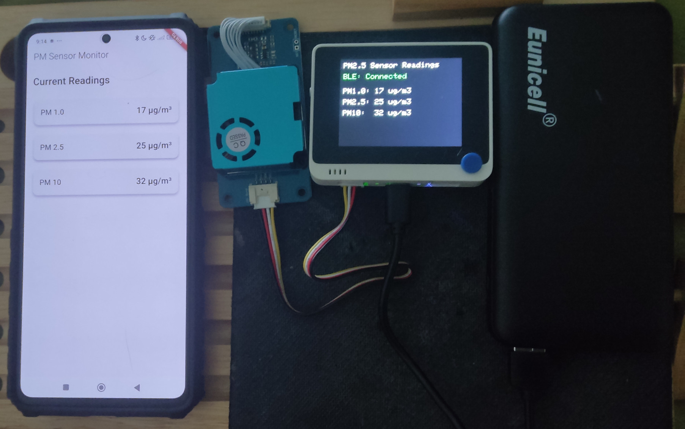

# Grove PM2.5 Monitor BLE Project

A [PlatformIO](https://platformio.org/project) project for the Seeed Wio Terminal that reads data from a Grove HM3301 PM2.5 laser dust sensor and broadcasts the readings over Bluetooth Low Energy (BLE).

## Hardware Requirements

- [Seeed Wio Terminal](https://wiki.seeedstudio.com/Wio_Terminal_Intro/)
- [Grove HM3301 Laser PM2.5 Sensor](https://wiki.seeedstudio.com/Grove-Laser_PM2.5_Sensor-HM3301/)
- microSD card (FAT32 formatted)
- I2C grove connection

## Features

- Real-time particulate matter measurements:
  - PM1.0 (atmospheric)
  - PM2.5 (atmospheric)
  - PM10.0 (atmospheric)
- BLE connectivity:
  - Device name: "PM2.5 Sensor"
  - Real-time data notifications
  - Historical data access
- TFT display showing:
  - Current PM readings
  - BLE connection status
  - Debug information
- Data logging:
  - Readings logged every 5 minutes to SD card
  - CSV format with timestamps
  - Automatic file management
- Historical data:
  - Hourly averages calculation
  - 24-hour history retention
  - Accessible via BLE
- Time synchronization:
  - Set the device time via BLE
- Alerting:
  - BLE alerts for high PM2.5 levels

## BLE Service Specifications

- Service UUID: `91bad492-b950-4226-aa2b-4ede9fa42f59`
- Characteristics:
  - PM1.0: `91bad493-b950-4226-aa2b-4ede9fa42f59` (Read, Notify)
  - PM2.5: `91bad494-b950-4226-aa2b-4ede9fa42f59` (Read, Notify)
  - PM10: `91bad495-b950-4226-aa2b-4ede9fa42f59` (Read, Notify)
  - History: `91bad496-b950-4226-aa2b-4ede9fa42f59` (Read)
  - Time Sync: `91bad497-b950-4226-aa2b-4ede9fa42f59` (Write)
  - Alert: `91bad498-b950-4226-aa2b-4ede9fa42f59` (Read, Notify)

## BLE Client/Central Example App
- [Flutter PM2.5 Monitor App](https://github.com/IoT-gamer/flutter_pm2_5_monitor_app)

## Dependencies

- [Seeed_HM330X (Grove PM2.5 Sensor Library)](https://github.com/Seeed-Studio/Seeed_PM2_5_sensor_HM3301)
- [Seeed_Arduino_rpcBLE](https://github.com/Seeed-Studio/Seeed_Arduino_rpcBLE)
- [Seeed_Arduino_rpcUnified](https://github.com/Seeed-Studio/Seeed_Arduino_rpcUnified)
- TFT_eSPI
- [Seeed_Arduino_FS](https://github.com/Seeed-Studio/Seeed_Arduino_FS)
- [Seeed_Arduino_RTC](https://github.com/Seeed-Studio/Seeed_Arduino_RTC)

## Data Storage

- Data is stored in `/data/PM_xxxx.csv` files on the SD card
- CSV format: `Power_Cycle,Timestamp,PM1.0,PM2.5,PM10,Uptime_Sec`
- Power cycles are tracked in `/data/power_cycle.txt`

## Update Intervals

- Sensor readings: Every 5 seconds
- Data logging: Every 5 minutes
- Hourly averages calculation: Every hour